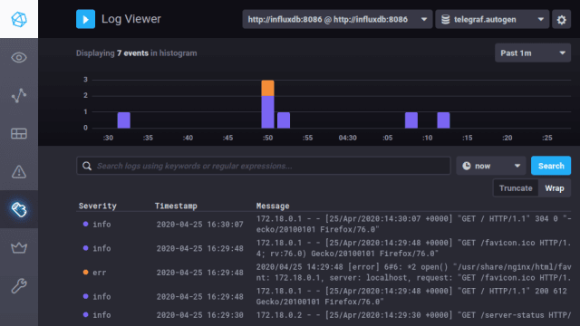

# Monitor Nginx logs using the Telegraf Syslog plugin

*A minimal working example of a TICK stack (Telegraf, Influxdb, Chronograf, Kapacitor) in a Docker setup with Nginx Syslog messages.*

This setup enables the Telegraf Syslog plugin to parse Nginx Syslog messages by using a Rsyslog relay server to convert the messages from the legacy format (BSD-syslog / RFC 3164) to the newer message format (IETF-syslog / RFC 5424).

## Prerequisites

- Docker 18.06.0+
- Docker Compose

*Note: The setup should work with much older versions of Docker, too, by lowering the version number in the docker-compose.yml, but please, update Docker instead.*

## Getting started

Run `docker-compose up` to start the containers.

Visit the default Nginx welcome page at <http://localhost:80>, the Nginx server status page at <http://localhost:8080/server-status> and the Chronograf UI at <http://localhost:8888>.
